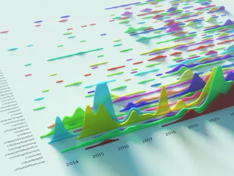
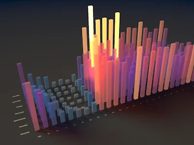

# r/GregBahm's Reddit Addiction Visualized

**[View the live visualization](https://gregbahm.github.io/RedditData/)**

<p align="center">
  <a href="https://gregbahm.github.io/RedditData/viz/Posts3dView.html"></a>
  <a href="https://gregbahm.github.io/RedditData/viz/SubredditDistribution3dView.html"></a>
  <a href="https://gregbahm.github.io/RedditData/viz/PostingPatterns3dView.html"></a>
</p>

A visualizer for Reddit history: posts and comments, score data, subreddit
distribution, trends, posting patterns, historical commentary, and interactive
path-traced 3D views.

The dashboard combines linked 2D timelines and distributions with standalone
3D views for posts, subreddit activity, and weekday/time-of-day patterns. The
3D views include configurable lighting, glow, depth of field, saved tunings,
and live-interaction recording with high-quality frame and MP4 export.

## Using the visualizer

Open the [live visualization](https://gregbahm.github.io/RedditData/) to explore
the built-in demo or select **Show me my own data**.

The demo also includes a standalone
[20-topic breakdown](https://gregbahm.github.io/RedditData/viz/TopicBreakdown.html)
of the complete committed posting history. Regenerate it with
`python build_topics.py`.

To visualize your own history:

1. Request an export from [Reddit's data request page](https://www.reddit.com/settings/data-request).
2. Download the ZIP Reddit emails to you; do not extract it.
3. Drop the ZIP onto the import screen.
4. Wait for score and thread-title enrichment, then select **Display my data**.

The ZIP and its CSV contents are read locally in your browser. They are not
uploaded to this project. Reddit's export omits scores, so only post and comment
IDs are sent to the third-party
[Arctic Shift](https://arctic-shift.photon-reddit.com) archive. The processed
dataset is stored in IndexedDB in your browser profile so the 2D and 3D views
share it. **Restore demo data** clears that stored personal dataset.

Some IDs may not exist in Arctic Shift. Those records remain visible and are
marked `score unavailable`; they are plotted at the zero-score position and do
not contribute points to score totals.

## Running locally

```
git clone https://github.com/GregBahm/RedditData.git
cd RedditData
python -m http.server 8765
```

Then open <http://127.0.0.1:8765/viz/>. The repository is self-contained.
The committed demo reads `viz/data.js`; personal imports remain only in the
browser profile.

## Browser dependencies

The following libraries are vendored so page loads do not depend on a CDN:

- [JSZip 3.10.1](https://github.com/Stuk/jszip), MIT or GPLv3
- [Papa Parse 5.4.1](https://www.papaparse.com/), MIT

Their license files are under `viz/vendor/`.

## Regenerating the data

`viz/data.js` is built by `fetch_scores.ps1` from a Reddit personal data export
(the CSV export from https://www.reddit.com/settings/data-request). The export
itself is **not** in this repo — it's large and private. The script:

1. Reads `posts.csv` and `comments.csv` from the export folder
2. Fetches score snapshots (and thread titles for comments) from the
   [Arctic Shift](https://arctic-shift.photon-reddit.com) archive API,
   since Reddit's export contains no scores
3. Merges everything and writes `viz/data.js`

To rerun it, you need an export folder on disk, and you'll need to edit the
hardcoded `$exportDir` and `$outFile` paths at the top of `fetch_scores.ps1`
to match your machine.
